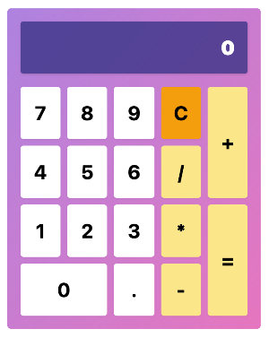

# ReScript Intro

This repo is a used to support [this meetup](https://www.meetup.com/spiced-academy/events/279779940) where we build a calculator Using ReScript, React + Tailwind.

You can find an example of the calculator deployed [here](https://rescript-calculator.netlify.app/). This code to this version of the calculator is available in the example branch of this repo.

## Tech Stack

The technologies used in this project:

- [ReScript](https://rescript-lang.org/)
- React in the form of [rescript-react](https://rescript-lang.org/docs/react/latest/introduction#sidebar)
- [TailwindCSS](https://tailwindcss.com/)
- [Vite.js](https://vitejs.dev/)

## Getting started

The project includes a .vscode folder with extension suggestions and setup for running in vscode.

1. Install the dependencies by running `yarn`.

2. Open this repo in vscode and install the suggested extension.

3. Open a `.res` file, for instance `App.res` and start the build which should be suggested by the popup in the bottom right corner.

4. Start Vite by running `yarn dev`.

5. Open http://localhost:3000 and you should be up and running.

# Building the calculator



This is how the example calculator looks like. This is a basic calculator that supports addition, subtraction, multiplication and division. To support these operations, the calculator is built around a simple state machine. There's a very basic state machine implementation in the `src/Machine.res` file. This allows you to create an instance of the state machine and use it to create the calculator.

## States

The states we need for the example calculator is shown in the following diagram.

```
                                          ┌────DigitPressed
                                          │         │
                                          ▼         │
┌─────────────┐                    ┌─────────────┐  │
│             │                    │             │  │
│   Initial   │────DigitPressed───▶│   Typing    │──┘
│             │                    │             │
└─────────────┘                    └─────────────┘
       ▲                           │      ▲      │
       │                           │      │   OperationPressed
       ├───────────ClearPressed────┘      │      └────────┐      ┌───OperationPressed
       │                                  │               │      │         │
       │                                  │               ▼      ▼         │
       │                                  │               ┌─────────────┐  │
       │                                  │               │             │  │
       ├───────────ClearPressed───────────┼───────────────│  Operating  │──┘
       │                                  │               │             │
       │                                  │               └─────────────┘
       │                                  │               ▲      │
       │                                  │               │      │
       │                                  │               │   EqualsPressed
       │                                  │               │      │
       │                                  │     OperationPressed │      ┌───EqualsPressed
       │                                  │               │      │      │         │
       │                                  │               │      ▼      ▼         │
       │                            DigitPressed          └──────┌─────────────┐  │
       │                                  │                      │             │  │
       │                                  └──────────────────────│   Result    │──┘
       │                                                         │             │
       └───────────ClearPressed──────────────────────────────────└─────────────┘
```
